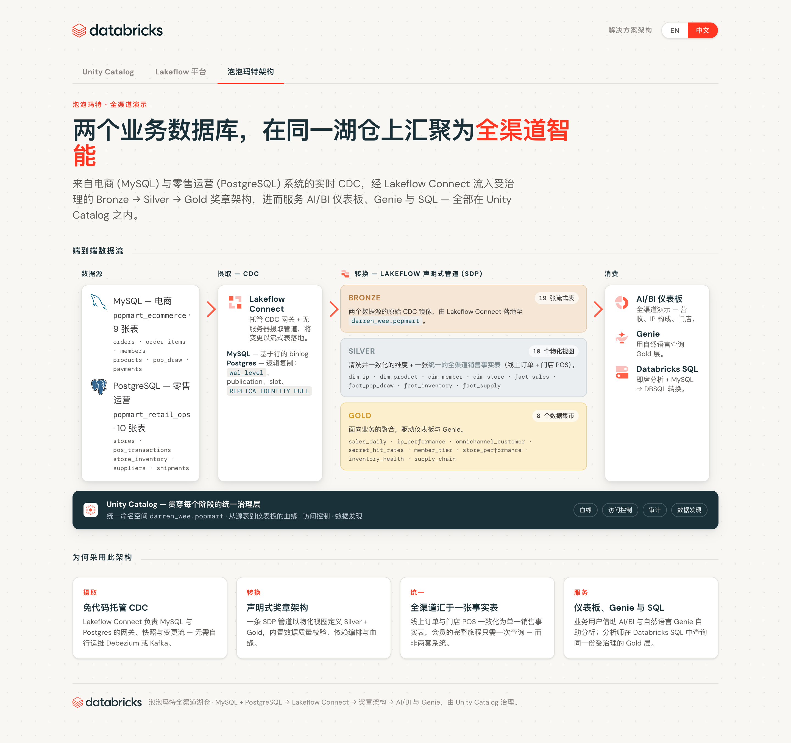
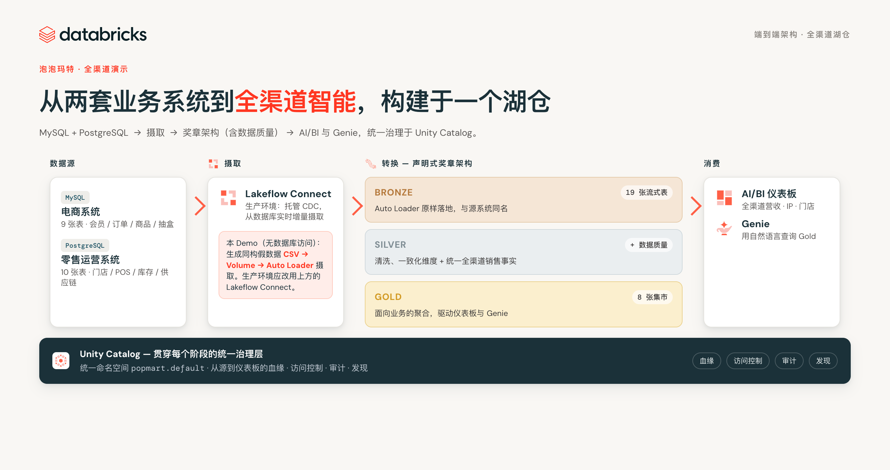
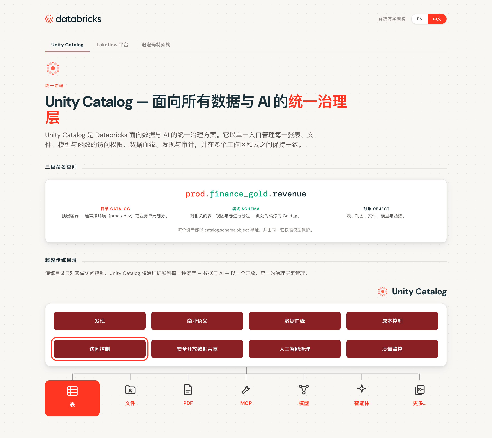
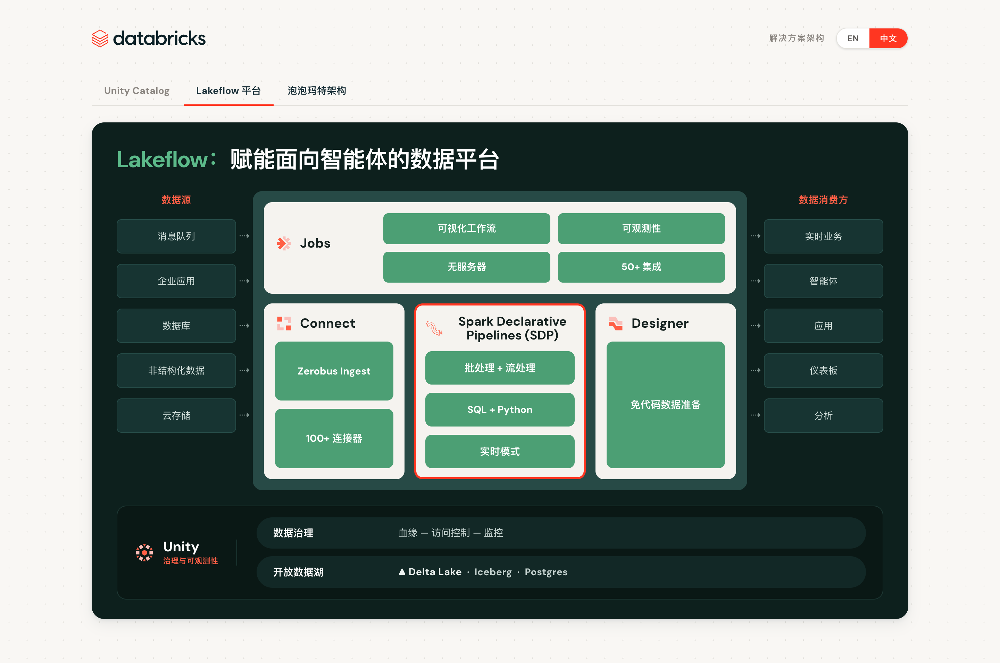

<div align="center">

# 🧸 Pop Mart 全渠道湖仓 · 端到端 Demo

**从两套业务系统到全渠道智能 —— 在一个 Databricks Lakehouse 上完成摄取、治理、分析与 AI**

以 [Databricks Asset Bundle (DABs)](https://docs.databricks.com/aws/en/dev-tools/bundles/) 一键部署：
数据生成 → Volume 落地 → Auto Loader 摄取 → 奖章架构（含数据质量）→ AI/BI 仪表板 + Genie 智能问答。

</div>



---

## 📖 业务背景

**泡泡玛特（Pop Mart）** 是一家潮流玩具零售商，以「盲盒」和 IP 形象（如 Labubu、Molly、Skullpanda）闻名。它的生意天然是**全渠道**的：

- 🛒 **线上**：App（iOS / Android）与官网直营商城，包含在线「抽盒」玩法；
- 🏬 **线下**：直营门店、Pop Bakery 主题店；
- 🤖 **机器人商店（Roboshop）**：遍布商场的自动贩卖机。

数据却分散在两套互不相通的系统里：

| 源系统 | 承载业务 | 表数量 |
|---|---|---|
| 电商系统（原 MySQL） | 会员、订单、商品、抽盒、评价 | 9 |
| 零售运营系统（原 PostgreSQL） | 门店、机器人商店、库存、POS、供应链 | 10 |

### 💢 面临的挑战
- **数据孤岛**：线上与线下无法拉通，看不清一个会员的完整旅程；
- **缺乏统一口径**：营收、IP 表现、盲盒中签率各算各的；
- **数据质量无保障**：脏数据直接流入报表；
- **治理与安全**：多系统、多团队，权限与血缘难以管理；
- **响应慢**：业务想问一个问题，要排队等分析师写 SQL。

---

## ✅ Databricks 如何端到端解决

> **关于数据摄取（重要）：** 出于 **Demo 目的**，本仓库用脚本**生成了同构的假数据集（CSV）**，再经 Auto Loader 摄取。
> **在生产环境中，这一步应改用 [Lakeflow Connect](https://docs.databricks.com/aws/en/ingestion/lakeflow-connect/) 的托管 CDC**，直接从 MySQL / PostgreSQL 实时增量摄取真实数据；其余环节（Silver、Gold、Unity Catalog 治理、Genie、仪表板）与生产完全一致。



### 1️⃣ 摄取 —— Lakeflow / Auto Loader
一个声明式管道把 CSV 以 **Auto Loader** 流式摄取为 19 张 Bronze 表，表名与源系统完全一致，支持增量与自动 schema 推断。

### 2️⃣ 转换 —— 声明式奖章架构（Lakeflow SDP）
一条 **Spark 声明式管道** 定义 Silver + Gold：
- **Silver**：清洗、一致化的维度与事实，并把线上订单和门店/机器人商店 POS 合并成一张 **统一全渠道销售事实表** `silver_fact_sales`；
- **数据质量 Expectations**（分级处理）：主键 `FAIL UPDATE`、事实脏数据 `DROP ROW` 隔离、软性指标告警 —— 全部体现在管道的 **Data Quality** 面板；
- **Gold**：8 张开箱即用的业务集市（营收、IP 表现、盲盒中签率、全渠道客户、会员分层、门店表现、库存健康、供应链）。

### 3️⃣ 治理 —— Unity Catalog
全流程由 **Unity Catalog** 统一治理：一个三级命名空间 `catalog.schema.object`、统一权限模型、自动血缘、审计与发现 —— 数据与 AI 资产尽在其中。



### 4️⃣ 平台 —— Lakeflow 一体化
摄取（Connect）、声明式管道（SDP）、编排（Jobs）与低代码准备（Designer）同属 **Lakeflow**，面向智能体时代的数据平台。



### 5️⃣ 消费 —— 仪表板 + Genie
- 📊 **AI/BI 仪表板**：8 个数据集、3 个页面，覆盖全渠道营收、IP、门店与供应链；
- 💬 **Genie 智能问答**：业务用户用自然语言直接提问（「哪个 IP 营收最高？线上线下如何拆分？」），无需写 SQL。

---

## 🗂️ 仓库内容（全部为 DAB 资源）

```
popmart-demo/
├── databricks.yml                     # Bundle 定义 + 变量 + 目标环境
├── resources/
│   ├── volume.yml                     # UC Volume（CSV 落地区）
│   ├── setup.job.yml                  # 生成数据的 Serverless 作业
│   ├── medallion.pipeline.yml         # 奖章架构管道（SDP）
│   ├── dashboard.yml                  # AI/BI 仪表板
│   └── genie.yml                      # Genie 空间（原生 DAB 资源）
├── src/
│   ├── setup/generate_seed_data.py    # 合成数据生成器（19 张表）
│   └── transformations/
│       ├── bronze.sql                 # Auto Loader → 19 张 Bronze 流式表
│       ├── silver.sql                 # 维度 + 事实 + 统一销售 + 数据质量
│       └── gold.sql                   # 8 张业务集市
├── dashboards/popmart_omnichannel.lvdash.json
├── genie/popmart.geniespace.json
└── docs/                              # 每个环节的说明文档（01–07）
```

| 环节 | 文档 |
|---|---|
| 架构总览 | [docs/01-architecture.md](docs/01-architecture.md) |
| 数据生成 | [docs/02-data-generation.md](docs/02-data-generation.md) |
| Auto Loader 摄取 | [docs/03-ingestion-autoloader.md](docs/03-ingestion-autoloader.md) |
| 奖章架构管道 | [docs/04-medallion-pipeline.md](docs/04-medallion-pipeline.md) |
| Genie 智能问答 | [docs/05-genie.md](docs/05-genie.md) |
| AI/BI 仪表板 | [docs/06-dashboard.md](docs/06-dashboard.md) |
| 部署手册 | [docs/07-deploy-runbook.md](docs/07-deploy-runbook.md) |

---

## 🚀 快速开始

前置条件：Databricks CLI ≥ 0.230、名为 `popmart` 的 profile、对 `popmart.default` 拥有建表/建卷权限。

```bash
cd popmart-demo

# 1. 校验 bundle
databricks bundle validate  -t dev --profile popmart

# 2. 部署所有资源（Volume / 作业 / 管道 / 仪表板 / Genie）
databricks bundle deploy    -t dev --profile popmart

# 3. 生成 CSV 数据并写入 Volume
databricks bundle run popmart_setup      -t dev --profile popmart

# 4. 运行奖章架构：Bronze → Silver → Gold
databricks bundle run popmart_medallion  -t dev --profile popmart

# 5. 打开仪表板与 Genie
databricks bundle summary -t dev --profile popmart
```

> 顺序很重要：**部署 → 生成数据 → 运行管道**。仪表板与 Genie 查询 Gold 表，因此在第 4 步之后生效。
> 目标可在 `databricks.yml` 中调整（默认 `catalog=popmart`、`schema=default`、数据量 `small ≈ 5 万行`）。

---

## 📦 数据集（全部 19 张表）

| 域 | 表 |
|---|---|
| 电商（9） | `ip_brands` · `product_series` · `products` · `members` · `orders` · `order_items` · `payments` · `pop_draw` · `product_reviews` |
| 零售运营（10） | `stores` · `roboshops` · `employees` · `product_catalog` · `suppliers` · `store_inventory` · `pos_transactions` · `purchase_orders` · `po_line_items` · `shipments` |

数据为确定性生成（`seed=42`）、全部 USD、约 24 个月历史，且保持外键一致性。

---

## 🎯 业务价值

- **全渠道拉通**：线上 + 门店 + 机器人商店，会员旅程一次查询即得；
- **可信数据**：数据质量校验内建于管道，脏数据在进入 Gold 前被隔离；
- **统一治理**：Unity Catalog 一处管理权限、血缘、审计；
- **人人可分析**：业务用 Genie 自然语言自助问答，分析师用同一份受治理的 Gold 层；
- **工程即代码**：整套方案以 DABs 声明，一条命令即可在任意工作区复现。

---

<div align="center">
<sub>由 Databricks Lakehouse 驱动 · MySQL + PostgreSQL → Lakeflow → 奖章架构 → AI/BI 与 Genie，统一治理于 Unity Catalog。</sub>
</div>
