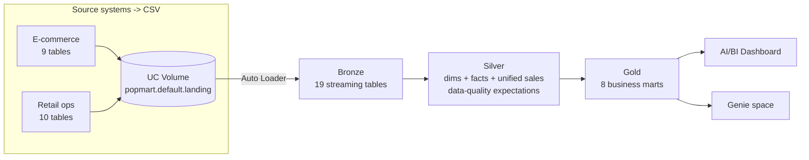

# 01 · Architecture

End-to-end omnichannel lakehouse for a Pop Mart–style designer-toy retailer, deployed
entirely as a **Databricks Asset Bundle**.

## Flow

In the real demo the sources are MySQL + PostgreSQL ingested by **Lakeflow Connect** (CDC).
Because this workspace has no database access, we **generate the same tables as CSV**, land
them in a **Unity Catalog Volume**, and ingest with **Auto Loader** — everything else
(Silver, Gold, Genie, dashboard) is identical.

## Components (all DAB resources)
| Resource | Name | File |
|---|---|---|
| Volume | `landing` | `resources/volume.yml` |
| Job (data gen) | `popmart_setup_generate_data` | `resources/setup.job.yml` |
| Pipeline (SDP) | `popmart_medallion` | `resources/medallion.pipeline.yml` |
| Dashboard | `Pop Mart Omnichannel Analytics` | `resources/dashboard.yml` |
| Genie space | `Pop Mart — Omnichannel Genie` | `resources/genie.yml` |

Target: catalog **`popmart`**, schema **`default`** (both configurable in `databricks.yml`).
