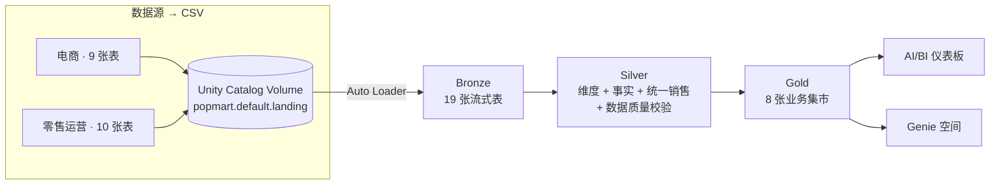

# 01 · 架构总览

面向「泡泡玛特」式潮玩零售商的端到端全渠道湖仓，全部以 **Databricks Asset Bundle（DABs）** 部署。

## 数据流

在真实场景中，数据源是由 **Lakeflow Connect（CDC）** 摄取的 MySQL + PostgreSQL。
由于本工作区没有数据库访问权限，我们**生成同构的 CSV 表**，落地到 **Unity Catalog Volume**，
再用 **Auto Loader** 摄取 —— 其余所有环节（Silver、Gold、Genie、仪表板）完全一致。

## 组成部分（全部为 DAB 资源）
| 资源 | 名称 | 文件 |
|---|---|---|
| Volume | `landing` | `resources/volume.yml` |
| 作业（数据生成） | `popmart_setup_generate_data` | `resources/setup.job.yml` |
| 管道（SDP） | `popmart_medallion` | `resources/medallion.pipeline.yml` |
| 仪表板 | `Pop Mart Omnichannel Analytics` | `resources/dashboard.yml` |
| Genie 空间 | `Pop Mart — Omnichannel Genie` | `resources/genie.yml` |

目标：catalog **`popmart`**、schema **`default`**（均可在 `databricks.yml` 中配置）。
